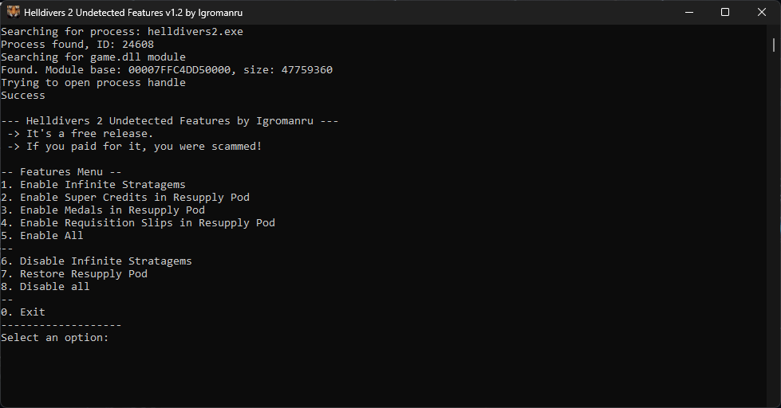

# Helldivers 2 Undetected Features by Igromanru

I decided to release the only features that I have that don't require .text section code patching, which is covered by integrity check of GameGuard.
Therefore, they are undetectable.
Since GameGuard detects Cheat Engine itself, I had to make an own application out of it.

## Don't use in public lobbies!  
**Getting reported is currently the only way to get banned.  
Don't drop Super Credits, Medals or Requisition Slips with randoms in a mission.  
You're not only risking your account, but also drawing attention to the exploit!**

## Features
- Infinite Stratagems
- Super Credits in Resupply Pod
- Medals in Resupply Pod
- Requisition Slips in Resupply Pod

### Video showcase

## How to use
Before you start, I recommend unzipping the files from the zip archive.
1. Load the game until you're in your ship
2. Run the **HD2UndetectedFeatures.exe** (you must have administrator rights on the Windows account)
3. Type one of the options number and press ENTER to select the option
4. You can keep selecting different options or exit the program

If you get the error `Couldn't open process handle`, you can try to repeat from Step 2.  
After multiple tries, you can try to restart the game. However, if GameGuard works properly, you are out of luck with this tool.
Try about 10 times to be sure before you give up.

## Details
- You can only pick up one of each resource spawn from a resupply pod, the server doesn't accept a second pickup of the same type. This is why I replace only one of the slots with SC, one with Medals and one with Requisition Slips.
- The game has only one ID for Super Credits, one ID for Medals and one ID for Requisition Slips. The amount of resources you get from one stack is random. For Super Credits there is 1% chance to get 100 instead of 10 from 1 stack. For Medals and Requisition Slips it's more random.

## Drops Information
- In each mission there is a random pick-up limit per player. After the limit is reached, the server will stop adding picked up resources to players.
- The limit is somehow related to the map size, mission type and terrain. The ideal map size is reached on difficulty 3, and overall difficulty 3 is the best for getting the most drops on average.
- Picked up resources are added to each player in the squad. It allows farming faster with more players, since each can pickup the same amount of stacks per mission.

## Disclaimer
1. The tool doesn't bypass the nProtect GameGaurd AntiCheat protection! It relies on the incompetence of the AntiCheat to protect the process.
If you keep getting the error message `Couldn't open process handle` no matter how many times you try, there is nothing I can do about it.
1. I provide the cheat tool as it is. Don't ask me for more features (unless you can contribute the features yourself), a GameGuard bypass or where you can get one. 
2. Infinite Stratagems with Resupply Pod drops is a very slow way to farm. There are much better and faster ways to farm with a bypass and cheats from closed/premium communities. Do your own research, if you are ready to spend money. I personally don't give away or sell anything.

##
  
